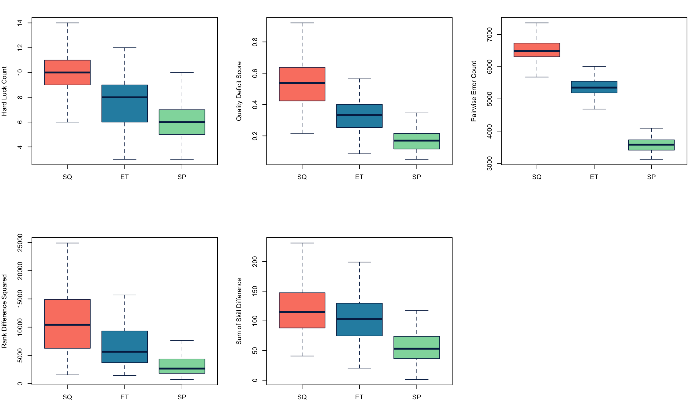
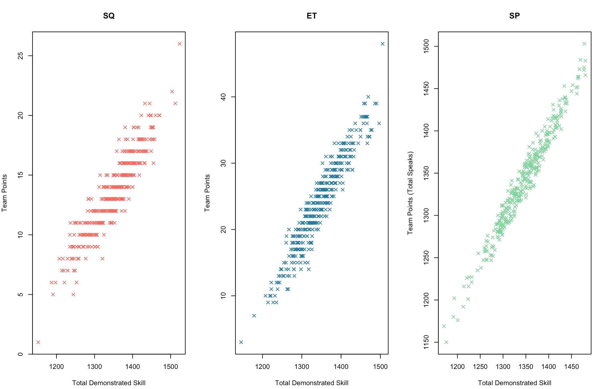

# Break Accuracy in British Parliamentary Debating

This is an open source replication of the model employed in [Barnes et al. 2020](https://international-debate.com/2020/03/18/tapered-points/). Its intended use case is as a starting point for researchers interested in British Parliamentary scoring systems and proposed improvements to the status quo system. By releasing it open source, I hope to encourage continued discussion on this topic. This break accuracy simulator may also be of interest to tournament convenors and chief adjudicators interested in preserving the accuracy of a tournament's results while contending with logistical constraints.

## How to use
The following assumes some knowledge of how British Parliamentary debate tournaments operate, and of the analysis in Barnes et al. 2020.

Simulating a tournament is split into three functions: generating draws (`simple_generate_draw`), generating team speaker scores (`run_round`), and scoring each round (`xx_score`). The functions operate independently of one another. For example, a new scoring system can be introduced by copying and modifying the `sq_score` function, without making any other changes. The `simulate_tournament` function combines these all together, taking a number of rounds, number of teams, and scoring system, and outputting team-by-team results for the tournament. These results are: team points, total speaker points, total demonstrated skill, and baseline skill (see Barnes et al. 2020). 

The `calculate_bqm` and `calculate_oam` functions take these results and output break accuracy and order accuracy metrics respectively. I use the same five metrics as are evaluated in Barnes et al. 2020: hard luck count (HLC), quality deficit score (QDS), pairwise error count (PEC), rank difference squared (RDS), and sum of skill difference (SSD).

This simulator was initially designed to compare scoring systems. The `et_sq_sp_compare` function does just this, comparing the early taper, status quo, and speaker points scoring systems across the five break accuracy and order metrics. Below is a visualization of the results of a small sample (N=100\*3) simulation of a WUDC-like tournament, with nine rounds and 360 teams.

A few things to note about these plots:
- Although this is a small sample, it is telling that early taper does better than status quo scoring on every metric, replicating the result in Barnes et al. 2020.
- This model is probably not suitable for evaluating the speaker points scoring system; the SP results are perhaps better regarded as a theoretical minimum for each accuracy/order metric.
- I measure the order accuracy metrics somewhat differently from Barnes et al. 2020 in that I do not exclude any parts of the tab when deriving them. In contrast, my understanding is that Barnes et al. exclude the bottom half of the tab, which reduces the time required to run simulations.
- Some other potential differences include: a) my draw generation function may not be working as intended, b) I keep judge perception bias at a constant standard deviation for each round, whereas Barnes et al. allude to decreasing perception bias in later rounds.

It is also interesting to see *why* early taper performs better than status quo scoring in this model.

The plots above illustrate the differences in how status quo, early taper, and speaker points scoring treat differences in teams' demonstrated skill. They each depict the results of a simulated tournament, with each point representing the performance of one team. Status quo scoring uses a limited number of brackets, each with a large number of teams of quite varied ability (R^2 = 0.85). Early taper uses a higher number of brackets, which allows it to distinguish between low-performing and high-performing teams with a higher degree of granularity than is possible with status quo scoring (R^2 = 0.91). Speaker points--keeping in mind my earlier caveat--has an even higher degree of granularity (R^2 = 0.96).

The `et_sq_sp_compare` function works by repeatedly simulating tournaments and recording accuracy/order metrics. A similar approach can be used to measure the effects of other changes, such as increasing the number of rounds.

Steps to replicate the figures above are included in the BP-simulator.R file.

## Next steps
The current version of this model contains the foundations for collaborative research into a variety of questions regarding BP debating--and indeed, other formats. Here are some of the improvements I want to make in the future. **I eagerly welcome any modifications to my code, or new models that borrow from it; feel free to reach out if there is anything I can do to help.**
- **Larger simulations:** Running simulations with more iterations will increase their precision. I am wary of running these while there are still potential mistakes in my code that would render any results obtained invalid.
- **A more accessible way of interacting with this:** The simplest way to make results accessible would be to run a bunch of simulations across a range of values for the parameters (e.g., number of teams, judge bias, variance in baseline skill, break size) and pop the statistics into an Excel file so that tournament convenors, etc. can get a rough idea of how to make their specific tournaments more accurate without running their own simulations.
- **More scoring systems:** So far, I've included nine-round early taper, status quo, and speaker points scoring systems. The model is designed such that the scoring systems already included can be swapped out for other systems without having to touch other parts of the code. (This is also true of adding new ways of allocating teams and of calculating new accuracy/order metrics.)
- **Other formats:** I have made a version of this for Australs-style (3v3) competitions, where there are only two teams in each room. This modification is (almost) as simple as replacing some of the 4s with 2s. I'm unfamiliar with the pre-existing literature on 3v3 break accuracy, but I would be interested in seeing if well-known results about BP (e.g., tournaments with even numbers of rounds are less accurate) hold for other formats as well.
